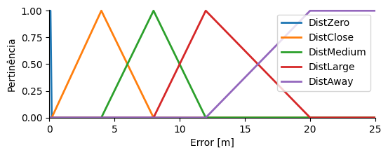
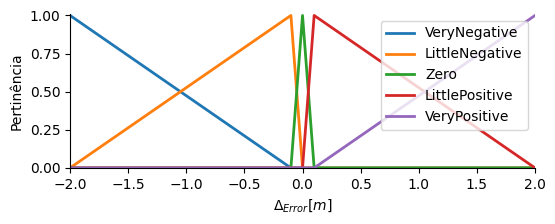
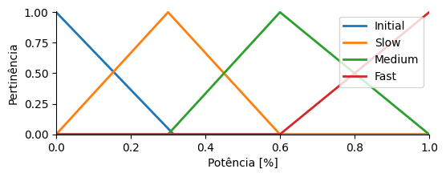
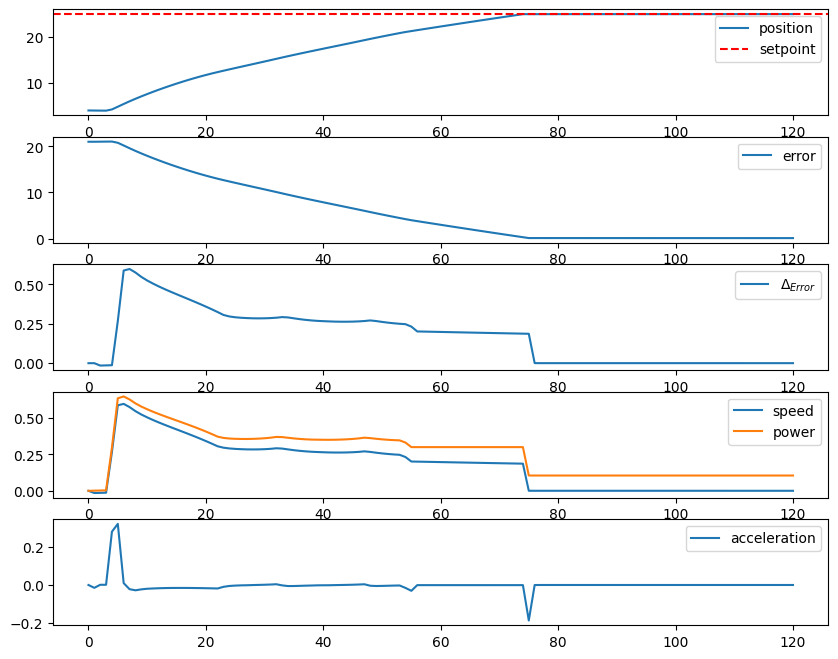

[comment]: <> "LTeX: language=pt-BR"

Fuzzy
===

<!-- column_layout: [1, 3, 1] -->
<!-- column: 1 -->
<!-- jump_to_middle -->
Lucas Ross - GEC - 1718
<!-- reset_layout -->

<!-- end_slide -->

0 - Bibliotecas
====

```python
import random

import numpy as np
import pandas as pd
import matplotlib.pyplot as plt

import skfuzzy as fuzzy
import skfuzzy.control as ctrl

import paho.mqtt.client as mqtt
```

<!-- end_slide -->

1 - Erro
====

```python
Error = ctrl.Antecedent(universe=np.arange(0, 25+0.1, 0.1), label='Error')

ZE = 'DistZero'
DC = 'DistClose'
DM = 'DistMedium'
DL = 'DistLarge'
DA = 'DistAway'

Error[ZE] = fuzzy.trapmf(Error.universe, [0, 0, 0.1, 0.2])
Error[DC] = fuzzy.trimf(Error.universe, [0.2, 4, 8])
Error[DM] = fuzzy.trimf(Error.universe, [4, 8, 12])
Error[DL] = fuzzy.trimf(Error.universe, [8, 12, 20])
Error[DA] = fuzzy.trapmf(Error.universe, [12, 20, 25, 25])
```



<!-- end_slide -->

2 - Delta Erro
====

```python
DeltaError = ctrl.Antecedent(universe=np.arange(-25, 25+0.1, 0.1), label='DeltaError')

MN = 'VeryNegative'
PN = 'LittleNegative'
ZE = 'Zero'
PP = 'LittlePositive'
MP = 'VeryPositive'

DeltaError[MN] = fuzzy.trapmf(DeltaError.universe, [-25, -25, -2, -0.1])
DeltaError[PN] = fuzzy.trimf(DeltaError.universe, [-2, -0.1, 0])
DeltaError[ZE] = fuzzy.trimf(DeltaError.universe, [-0.1, 0, 0.1])
DeltaError[PP] = fuzzy.trimf(DeltaError.universe, [0, 0.1, 2])
DeltaError[MP] = fuzzy.trapmf(DeltaError.universe, [0.1, 2, 25, 25])
```



<!-- end_slide -->

3 - Potência
====

```python
Power = ctrl.Consequent(universe=np.arange(0, 1.005, 0.005), label='Power')

IN = 'Initial'
SL = 'Slow'
MD = 'Medium'
FT = 'Fast'

Power[IN] = fuzzy.trimf(Power.universe, [0, 0, 0.315])
Power[SL] = fuzzy.trimf(Power.universe, [0.0, 0.3, 0.6])
Power[MD] = fuzzy.trimf(Power.universe, [0.3, 0.6, 1])
Power[FT] = fuzzy.trimf(Power.universe, [0.6, 1, 1])
```



<!-- end_slide -->

4 - Regras
====

<!-- column_layout: [1, 2] -->

<!-- column: 0 -->
|    | ZE | DC | DM | DL | DA |
| -- | -- | -- | -- | -- | -- |
| MN | IN | SL | MD | MD | FT |
| PN | IN | SL | SL | SL | MD |
| ZE | IN | IN | IN | IN | IN |
| PP | IN | SL | SL | SL | MD |
| MP | IN | SL | MD | MD | FT |

Controle direto:

- _e > 0_: acima
- _e < 0_: abaixo

<!-- column: 1 -->

```python
import itertools

results = [
    IN, IN, IN, IN, IN,
    SL, SL, IN, SL, SL,
    MD, SL, IN, SL, MD,
    MD, SL, IN, SL, MD,
    FT, MD, IN, MD, FT,
]

rules = [
    ctrl.Rule(Error[v] & DeltaError[i], Power[r])
    for (v, i), r in
    zip(itertools.product(
        Error.terms.keys(), DeltaError.terms.keys()
    ), results)
]

rules
```

<!-- reset_layout -->
<!-- end_slide -->

5.1 - Simulação
====

```python
CtrlPower = ctrl.ControlSystemSimulation(ctrl.ControlSystem(rules))
CtrlPower
```

<!-- pause -->

```python
current_position = 4
set_point = 25

acceptable_error = 0.1

time = np.arange(0, 121, 1)

powers = [0]
positions = [current_position]
errors = [abs(set_point - current_position)]
delta_errors = [0]
speeds = [0]
accels = [0]

previous_error = abs(set_point - current_position)
previous_speed = 0
```

<!-- end_slide -->

```python
for t in time[1:]:
    raw_error = set_point - current_position
    current_error = abs(raw_error)
    current_delta_error = previous_error - current_error

    if t > 3:
        CtrlPower.input[Error.label] = current_error
        CtrlPower.input[DeltaError.label] = current_delta_error
        CtrlPower.compute()
        power = CtrlPower.output[Power.label]
    else:
        power = (t*0.315/3) / 100
    
    previous_position = current_position
    # if current_error >= acceptable_error:
    c = -1 if raw_error < 0 else 1
    current_position = abs(current_position*0.996*c + 100*power * 0.00951)
        
    previous_error = current_error

```

<!-- end_slide -->

```python
    speed = current_position - previous_position # speed m/s
    accel = speed - previous_speed # acceleration m/s^2
    previous_speed = speed
    
    positions.append(current_position)
    powers.append(power)
    errors.append(current_error)
    delta_errors.append(current_delta_error)
    speeds.append(speed)
    accels.append(accel)
```

<!-- end_slide -->

```python
plt.subplots(5, 1)

plt.subplot(5, 1, 1)
plt.plot(time, positions, label='position')
plt.axhline(set_point, color='r', linestyle='--', label='setpoint')
plt.legend()

plt.subplot(5, 1, 2)
plt.plot(time, errors, label='error')
plt.legend()

plt.subplot(5, 1, 3)
plt.plot(time, delta_errors, label='$\Delta_{Error}$')
plt.legend()

plt.subplot(5, 1, 4)
plt.plot(time, speeds, label='speed')
plt.plot(time, powers, label='power')
plt.legend()

plt.subplot(5, 1, 5)
plt.plot(time, accels, label='acceleration')
plt.legend()
```

<!-- end_slide -->

5.2 - Simulação
====



<!-- end_slide -->

6 - MQTT
====

```python
mqttBroker = "test.mosquitto.org"
client = mqtt.Client(
    mqtt.CallbackAPIVersion.VERSION1,
    f'python-mqtt-{random.randint(0, 1000)}'
)
client.connect(mqttBroker)
```

<!-- pause -->

```bash
docker run -it -p 1880:1880 -v node_red_data:/data --name mynodered nodered/node-red
```

<!-- end_slide -->

```python
import time

class App:
    def __init__(self, ctrl, client):
        self.ctrl = ctrl

        self.client = client
        self.client.subscribe('oh_no/what_have_i_done/set_point/force')
        self.client.on_message = self.on_message

        self.acceptable_error = 0.1
        self.time_running = 0

        self.set_point = 4
        self.current_position = 4

```

<!-- pause -->

```python
    def on_message(self, client, userdata, msg):
        # print(msg.payload, msg.topic)

        if msg.topic == 'oh_no/what_have_i_done/set_point/force':
            self.set_point = int(msg.payload)
            self.time_running = 0

```

<!-- end_slide -->

```python
    def run(self):
        print('running')
        while True:
            self.step()

            self.client.publish('oh_no/what_have_i_done/position', self.current_position)
            self.client.publish('oh_no/what_have_i_done/set_point', self.set_point)
            print(
                self.time_running, '::',
                self.current_position, '->',
                self.set_point,
                end='\t\r'
            )

            self.client.loop()
            self.time_running += 1
            time.sleep(1)

```

<!-- end_slide -->

```python
    def step(self):
        raw_error = self.set_point - self.current_position
        current_error = abs(raw_error)
        current_delta_error = previous_error - current_error

        # if current_error < self.acceptable_error:
        #     return

        if self.time_running <= 3:
            power = (self.time_running*0.315/3) / 100
        else:
            self.ctrl.input[Error.label] = current_error
            self.ctrl.input[DeltaError.label] = current_delta_error
            self.ctrl.compute()
            power = self.ctrl.output[Power.label]

            c = -1 if raw_error < 0 else 1
            self.current_position = abs(
                self.current_position*0.996*c + 100*power * 0.00951)

        self.client.publish('oh_no/what_have_i_done/power', power)
```

<!-- pause -->

```python
app = App(CtrlPower, client)
app.run()
```
